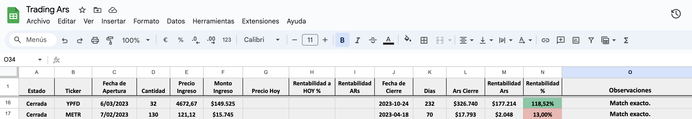
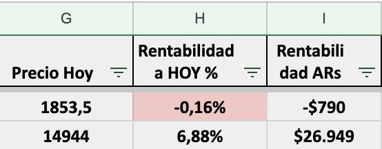
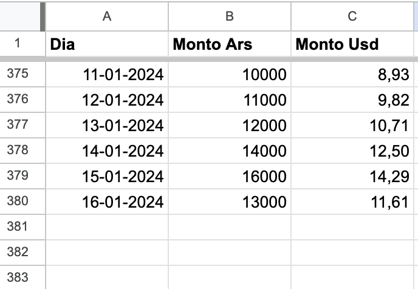

# Cocos Capital To Google Spreadsheet

## Descripción
"Cocos Capital To Google Spreadsheet" es un sistema de automatización de trading diseñado para sincronizar y procesar transacciones financieras utilizando la API de Cocos Capital. Este sistema facilita la gestión y análisis de datos de trading, actualizando automáticamente una hoja de cálculo de Google con detalles de las transacciones, precios de los activos y cálculos de rentabilidad.

## Características
- Sincronización automática de transacciones de trading desde la API de Cocos Capital.
- Clasificación y procesamiento detallado de compras y ventas.
- Actualización en tiempo real de precios y rentabilidades en la hoja de cálculo de Google.
- Cálculo de rentabilidad tanto en porcentaje como en moneda local.

## Requisitos Previos
Para utilizar este sistema, necesitarás:
- Python 3.x.
- Una cuenta en Cocos Capital.
- Credenciales JSON de Google Cloud para el acceso por API a Google Sheets.
- Una clave de aplicación de Gmail para recibir y procesar el doble factor de autenticación. Podés encontrar más información sobre cómo crear esta clave [aquí](https://support.google.com/accounts/answer/185833?hl=en).

## Instalación
Para instalar el sistema, sigue estos pasos:
1. Clonar el repositorio:
```bash
git clone https://github.com/PabloAlaniz/Cocos-Capital-To-Google-Spreadsheet.git
```

2. Instalar las dependencias necesarias:
```
pip install -r requirements.txt
```
---
## Configuración
Crear `config.py` y `credenciales-google.json`.

### Paso 1:
Crea un archivo `config.py` en la raíz del proyecto con las siguientes variables:

- `USER`: Tu nombre de usuario en Cocos Capital.
- `PASS`: Tu contraseña en Cocos Capital.
- `ACCOUNT_ID`: Tu ID de cuenta en Cocos Capital.
- `GOOGLE_SHEET_FILE`: El nombre de tu archivo de Google Sheets.
- `SHEET_TAB`: El nombre de la pestaña dentro del archivo de Google Sheets.
- `GMAIL_USER`: Tu correo de Gmail.
- `GMAIL_APP_PASS`: Tu clave de aplicación de Gmail.
- `JSONGOOGLEFILE`: La ruta al archivo JSON con tus credenciales de Google Cloud.
- `prefix_buy`: Prefijo utilizado para operaciones de compra.
- `prefix_sell`: Prefijo utilizado para operaciones de venta.
- `config`: Un diccionario que mapea los términos utilizados en la aplicación a los nombres de las columnas de la API, lo que permite cambios fáciles si la API cambia en el futuro.

#### Ejemplo:

```python
# config.py
USER = 'tuemail@gmail.com'
PASS = 'tupassword'
ACCOUNT_ID = '11111'
JSONGOOGLEFILE = 'credenciales-json.json'
GOOGLE_SHEET_FILE = "Trading Ars"
SHEET_TAB = "Operaciones"
GMAIL_USER = 'tuemail@gmail.com'
GMAIL_APP_PASS = 'tuclaveappgmail'
prefix_buy = 'buy_'
prefix_sell = 'sell_'
config = {
    'monto': 'amount',
    'ticker': 'ticker',
    'fecha': 'date',
    'cantidad': 'quantity',
    'precio': 'price'
}
```
### Paso 2:
Crea un archivo `credenciales-google.json` en la raíz del proyecto con tus credenciales de Google Cloud.
Se puede obtener siguiendo los pasos de este tutorial: https://github.com/PabloAlaniz/GSpreadManager/?tab=readme-ov-file#pre-requisitos

---
## Uso
Para usar el sistema, ejecuta el script principal:

```
python main.py
```

Se ejecuta sync_all con dos parametros (event, context). Estos parametros son necesarios para que funcione en Google Cloud Functions. Pero no son necesarios para ejecutarlo localmente.

## Funcionamiento
Hace 2 grandes cosas:
1. Guarda en una hoja de cálculo de google las operaciones con su respectiva rentabilidad ya sean abiertas o cerradas.
2. Guarda en otra hoja de solapa de la hoja de cálculo el monto total de la cuenta.

Veamos las 2 partes en detalle

### 1. Guardar operaciones
Se ejecuta con get_and_save_range_movements('2022-09-01'). 

Hay que pasarle dos parametros:
- La fecha desde la cual se quieren obtener las operaciones.
- La fecha hasta la cual se quieren obtener las operaciones. (Opcional, default es hoy)   

Esto completa el archivo de google sheet con las operaciones que se hicieron en ese rango de fechas. Pero lo hace en un formato que nos permite analizar la operacion.


Como se puede observar genera columnas con determinada información según la operación esté abierta o cerrada. 

En el caso de que la operación esté cerrada se completan estas columnas
- Estado: Abierta o Cerrada
- Ticker: El nombre del ticker
- Fecha de apertura: La fecha de apertura de la operación
- Cantidad: La cantidad de acciones compradas
- Precio de compra: El precio de compra de la acción individual
- Monto de compra: El monto total de la compra (Cantidad * Precio de compra)
- Fecha de cierre: La fecha de cierre de la operación
- Dias abierta: La cantidad de días que estuvo abierta la operación
- Ars Cierre: El monto total de la venta (Cantidad * Precio de venta)
- Rentabilidad Ars: La rentabilidad en pesos de la operación (Ars Cierre - Monto de compra)
- Rentabilidad %: La rentabilidad en porcentaje de la operación (Rentabilidad Ars / Monto de compra)

Cuando la operación está abierta, se completan determinadas columnas para ver el resultado a hoy.


Las 3 columnas son:
- Precio actual: El precio actual de la accion
- Rentabilidad a Hoy %: La rentabilidad en porcentaje de la operación (Precio actual / Precio de compra)
- Rentabilidad a Hoy Ars: La rentabilidad en pesos de la operación (Rentabilidad a Hoy % * Monto de compra)

### 2. Guardar monto total de la cuenta
Se ejecuta con insert_total_daily().
Guarda el monto total de la cuenta en una hoja distinta.

Las 3 columnas son:
- Fecha: La fecha del día
- Monto Ars: El monto total de la cuenta en pesos
- Monto USD: El monto total de la cuenta en dolares

Cada ejecución agrega una nueva linea guardando la fecha en la que se ejecutó

---

## To Do
- [ ] Manejo de dividendos
- [ ] Manejo de splits
- [ ] Manejo de impuestos
- [ ] Manejo de comisiones
- [ ] Generar una solapa de rendimiento por mes

## Contribuciones
Si deseas contribuir al proyecto, por favor, envía tus pull requests a la rama principal.

## Licencia
[MIT](https://choosealicense.com/licenses/mit/)

## Contacto
Si tenés alguna pregunta o sugerencia, no dudes en contactarme via [Twitter](http://www.twitter.com/PabloAlaniz) o [Email](mailto:pablo@culturainteractiva.com).
