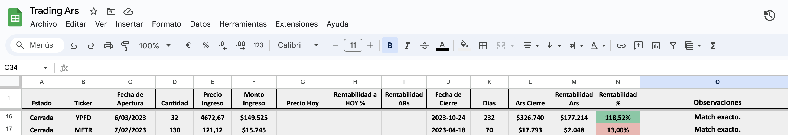
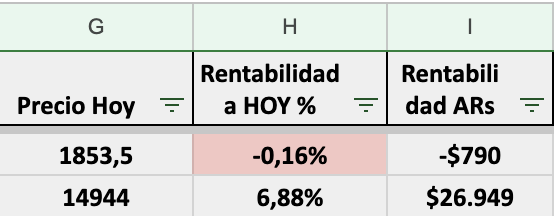
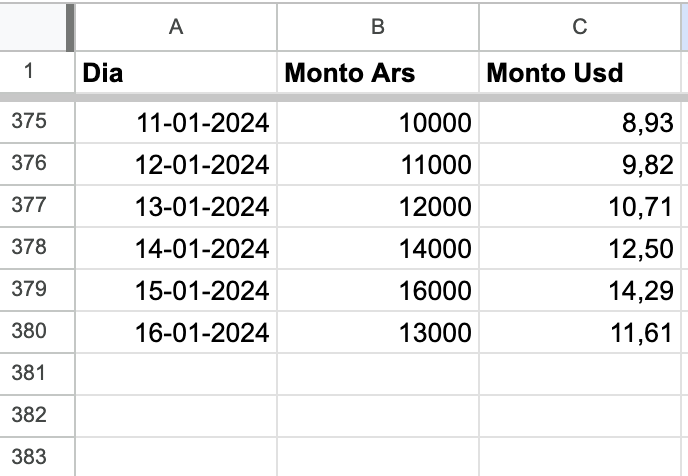

# Cocos Capital To Google Spreadsheet

Sistema de automatización de trading que sincroniza y procesa transacciones financieras desde la API de Cocos Capital hacia Google Sheets, con seguimiento de rentabilidad en tiempo real.

## 🎯 Descripción

"Cocos Capital To Google Spreadsheet" es un sistema de automatización de trading diseñado para sincronizar y procesar transacciones financieras utilizando la API de Cocos Capital. Este sistema facilita la gestión y análisis de datos de trading, actualizando automáticamente una hoja de cálculo de Google con detalles de las transacciones, precios de los activos y cálculos de rentabilidad.

## ✨ Características
- Sincronización automática de transacciones de trading desde la API de Cocos Capital.
- Clasificación y procesamiento detallado de compras y ventas.
- Actualización en tiempo real de precios y rentabilidades en la hoja de cálculo de Google.
- Cálculo de rentabilidad tanto en porcentaje como en moneda local.
- Matching inteligente de operaciones (exacto y acumulado).
- Tracking de operaciones abiertas con rentabilidad a hoy.
- Autenticación 2FA automatizada vía Gmail.

## 🚀 Quick Start (5 minutos)

```bash
# 1. Clonar el repositorio
git clone https://github.com/PabloAlaniz/Cocos-Capital-To-Google-Spreadsheet.git
cd Cocos-Capital-To-Google-Spreadsheet

# 2. Instalar dependencias
pip install -r requirements.txt

# 3. Configurar credenciales (ver Configuración abajo)
# Crear config.py y credenciales-google.json

# 4. Ejecutar
python main.py
```

**⚠️ Antes de ejecutar:** Asegurate de tener configurado `config.py` y `credenciales-google.json` (ver sección Configuración).

## 📋 Requisitos Previos
Para utilizar este sistema, necesitarás:
- Python 3.x.
- Una cuenta en Cocos Capital.
- Credenciales JSON de Google Cloud para el acceso por API a Google Sheets.
- Una clave de aplicación de Gmail para recibir y procesar el doble factor de autenticación. Podés encontrar más información sobre cómo crear esta clave [aquí](https://support.google.com/accounts/answer/185833?hl=en).

## Instalación
Para instalar el sistema, sigue estos pasos:
1. Clonar el repositorio:
```bash
git clone https://github.com/PabloAlaniz/Cocos-Capital-To-Google-Spreadsheet.git
```

2. Instalar las dependencias necesarias:
```
pip install -r requirements.txt
```
---
## Configuración
Crear `config.py` y `credenciales-google.json`.

### Paso 1:
Crea un archivo `config.py` en la raíz del proyecto con las siguientes variables:

- `USER`: Tu nombre de usuario en Cocos Capital.
- `PASS`: Tu contraseña en Cocos Capital.
- `ACCOUNT_ID`: Tu ID de cuenta en Cocos Capital.
- `GOOGLE_SHEET_FILE`: El nombre de tu archivo de Google Sheets.
- `SHEET_TAB`: El nombre de la pestaña dentro del archivo de Google Sheets.
- `GMAIL_USER`: Tu correo de Gmail.
- `GMAIL_APP_PASS`: Tu clave de aplicación de Gmail.
- `JSONGOOGLEFILE`: La ruta al archivo JSON con tus credenciales de Google Cloud.
- `prefix_buy`: Prefijo utilizado para operaciones de compra.
- `prefix_sell`: Prefijo utilizado para operaciones de venta.
- `config`: Un diccionario que mapea los términos utilizados en la aplicación a los nombres de las columnas de la API, lo que permite cambios fáciles si la API cambia en el futuro.

#### Ejemplo:

```python
# config.py
USER = 'tuemail@gmail.com'
PASS = 'tupassword'
ACCOUNT_ID = '11111'
JSONGOOGLEFILE = 'credenciales-json.json'
GOOGLE_SHEET_FILE = "Trading Ars"
SHEET_TAB = "Operaciones"
GMAIL_USER = 'tuemail@gmail.com'
GMAIL_APP_PASS = 'tuclaveappgmail'
prefix_buy = 'buy_'
prefix_sell = 'sell_'
config = {
    'monto': 'amount',
    'ticker': 'ticker',
    'fecha': 'date',
    'cantidad': 'quantity',
    'precio': 'price'
}
```
### Paso 2:
Crea un archivo `credenciales-google.json` en la raíz del proyecto con tus credenciales de Google Cloud.
Se puede obtener siguiendo los pasos de este tutorial: https://github.com/PabloAlaniz/GSpreadManager/?tab=readme-ov-file#pre-requisitos

---

## 🏗️ Arquitectura

El proyecto sigue una arquitectura modular con separación de responsabilidades:

```
┌─────────────────────────────────────────────────────────────┐
│                         main.py                              │
│                    (Entry Point)                             │
└──────────────────────┬──────────────────────────────────────┘
                       │
                       ▼
┌─────────────────────────────────────────────────────────────┐
│                      trading.py                              │
│                 (Trading Orchestrator)                       │
│  - get_and_save_range_movements()                           │
│  - insert_total_daily()                                      │
└──┬─────────────────────┬────────────────────────────────┬───┘
   │                     │                                │
   ▼                     ▼                                ▼
┌──────────────┐  ┌─────────────────┐  ┌───────────────────────┐
│   cocos.py   │  │ gspreadmanager  │  │ trading_operations.py │
│ (API Client) │  │ (Google Sheets) │  │   (Matching Logic)    │
│              │  │                 │  │                       │
│ - login()    │  │ - append()      │  │ - analizar_match()    │
│ - get_trans()│  │ - update()      │  │ - match_exacto()      │
│ - 2FA auto   │  └─────────────────┘  │ - match_acumulado()   │
└──────────────┘                        └───────────────────────┘
       │
       ▼
┌───────────────────────┐
│ exctract_2fa_from_    │
│      gmail.py         │
│ (Gmail 2FA Extraction)│
└───────────────────────┘
```

### Módulos Principales

| Módulo | Propósito |
|--------|-----------|
| `main.py` | Entry point del sistema. Instancia `Trading` y ejecuta sincronización. |
| `trading.py` | Orquestador principal. Coordina API Cocos, Google Sheets y matching. |
| `cocos.py` | Cliente de la API de Cocos Capital (`CocosCapital` class). Maneja login con 2FA. |
| `trading_operations.py` | Lógica de matching de operaciones (`TradingOperations` class). |
| `transform_data.py` | Funciones de transformación y filtrado de datos (pandas). |
| `exctract_2fa_from_gmail.py` | Extrae códigos 2FA desde Gmail API. |
| `log_config.py` | Configuración centralizada de logging. |
| `helpers.py` | Utilidades generales (actualmente vacío). |

### Flujo de Datos

1. **Autenticación:** `cocos.py` se conecta a Cocos Capital API y extrae código 2FA desde Gmail.
2. **Obtención de transacciones:** `trading.py` obtiene transferencias desde la API en un rango de fechas.
3. **Clasificación:** Se separan compras, ventas y otras operaciones (`transform_data.py`).
4. **Matching:** `trading_operations.py` empareja compras con ventas (exacto y acumulado).
5. **Cálculo de rentabilidad:** Para operaciones cerradas y abiertas.
6. **Sincronización:** `gspreadmanager` actualiza Google Sheets con los resultados.

---
## 📖 Uso
Para usar el sistema, ejecuta el script principal:

```
python main.py
```

Se ejecuta sync_all con dos parametros (event, context). Estos parametros son necesarios para que funcione en Google Cloud Functions. Pero no son necesarios para ejecutarlo localmente.

## Funcionamiento
Hace 2 grandes cosas:
1. Guarda en una hoja de cálculo de google las operaciones con su respectiva rentabilidad ya sean abiertas o cerradas.
2. Guarda en otra hoja de solapa de la hoja de cálculo el monto total de la cuenta.

Veamos las 2 partes en detalle

### 1. Guardar operaciones
Se ejecuta con get_and_save_range_movements('2022-09-01'). 

Hay que pasarle dos parametros:
- La fecha desde la cual se quieren obtener las operaciones.
- La fecha hasta la cual se quieren obtener las operaciones. (Opcional, default es hoy)   

Esto completa el archivo de google sheet con las operaciones que se hicieron en ese rango de fechas. Pero lo hace en un formato que nos permite analizar la operacion.


Como se puede observar genera columnas con determinada información según la operación esté abierta o cerrada. 

En el caso de que la operación esté cerrada se completan estas columnas
- Estado: Abierta o Cerrada
- Ticker: El nombre del ticker
- Fecha de apertura: La fecha de apertura de la operación
- Cantidad: La cantidad de acciones compradas
- Precio de compra: El precio de compra de la acción individual
- Monto de compra: El monto total de la compra (Cantidad * Precio de compra)
- Fecha de cierre: La fecha de cierre de la operación
- Dias abierta: La cantidad de días que estuvo abierta la operación
- Ars Cierre: El monto total de la venta (Cantidad * Precio de venta)
- Rentabilidad Ars: La rentabilidad en pesos de la operación (Ars Cierre - Monto de compra)
- Rentabilidad %: La rentabilidad en porcentaje de la operación (Rentabilidad Ars / Monto de compra)

Cuando la operación está abierta, se completan determinadas columnas para ver el resultado a hoy.


Las 3 columnas son:
- Precio actual: El precio actual de la accion
- Rentabilidad a Hoy %: La rentabilidad en porcentaje de la operación (Precio actual / Precio de compra)
- Rentabilidad a Hoy Ars: La rentabilidad en pesos de la operación (Rentabilidad a Hoy % * Monto de compra)

### 2. Guardar monto total de la cuenta
Se ejecuta con insert_total_daily().
Guarda el monto total de la cuenta en una hoja distinta.

Las 3 columnas son:
- Fecha: La fecha del día
- Monto Ars: El monto total de la cuenta en pesos
- Monto USD: El monto total de la cuenta en dolares

Cada ejecución agrega una nueva linea guardando la fecha en la que se ejecutó

---

## 🧪 Testing

El proyecto incluye tests automatizados con pytest.

### Ejecutar Tests

```bash
# Todos los tests
pytest

# Con verbosidad
pytest -v

# Con coverage
pytest --cov=. --cov-report=html
```

### Estructura de Tests

```
tests/
├── __init__.py
├── conftest.py          # Fixtures compartidos
└── test_log_config.py   # Tests de configuración de logging
```

### Tests Disponibles

- **test_log_config.py:** Valida la configuración del sistema de logging.

**To Do Testing:**
- [ ] Tests para `cocos.py` (mock de API)
- [ ] Tests para `trading_operations.py` (matching scenarios)
- [ ] Tests para `transform_data.py` (transformaciones)
- [ ] Tests de integración end-to-end

---

## 🚀 Deploy a Google Cloud Functions

El sistema está preparado para ejecutarse en Google Cloud Functions. El método `sync_all()` en `trading.py` acepta los parámetros estándar de Cloud Functions (`event`, `context`).

### Deploy Manual

```bash
# 1. Instalar gcloud CLI
# https://cloud.google.com/sdk/docs/install

# 2. Autenticarse
gcloud auth login

# 3. Configurar proyecto
gcloud config set project YOUR_PROJECT_ID

# 4. Deploy
gcloud functions deploy cocos_sync \
  --runtime python39 \
  --trigger-http \
  --entry-point sync_all \
  --allow-unauthenticated \
  --timeout 540s \
  --memory 512MB \
  --set-env-vars GOOGLE_SHEET_FILE="Trading Ars",SHEET_TAB="Operaciones"

# 5. Configurar secrets
gcloud secrets create cocos_config --data-file=config.py
gcloud secrets create google_creds --data-file=credenciales-google.json
```

### Deploy con Cloud Scheduler (Ejecución Periódica)

```bash
# Crear job que ejecuta diariamente a las 8:00 AM
gcloud scheduler jobs create http cocos_daily_sync \
  --location=southamerica-east1 \
  --schedule="0 8 * * *" \
  --uri="https://YOUR_REGION-YOUR_PROJECT.cloudfunctions.net/cocos_sync" \
  --http-method=POST \
  --time-zone="America/Argentina/Buenos_Aires"
```

### Notas de Deploy

- **Timeout:** Configurar timeout alto (540s) para transacciones con muchos registros.
- **Memory:** 512MB es suficiente para la mayoría de casos. Aumentar si procesas >5000 transacciones.
- **Secrets:** Usar Google Secret Manager para `config.py` y `credenciales-google.json` en producción.
- **Logs:** Ver logs con `gcloud functions logs read cocos_sync --limit 50`

---

## 🛠️ Troubleshooting

### Error: "Authentication failed, unable to proceed without token"

**Causa:** Credenciales incorrectas de Cocos Capital o problema con 2FA.

**Solución:**
1. Verificar `USER` y `PASS` en `config.py`
2. Asegurar que la app password de Gmail esté configurada correctamente
3. Verificar que el 2FA esté habilitado en Cocos Capital
4. Revisar logs: `tail -f logs/app.log`

### Error: "gspreadmanager not found"

**Causa:** Dependencia faltante.

**Solución:**
```bash
pip install gspreadmanager
```

Si el error persiste, verificar que esté en `requirements.txt`:
```bash
echo "gspreadmanager>=0.1.0" >> requirements.txt
pip install -r requirements.txt
```

### Error: "Invalid credentials for Google Sheets"

**Causa:** Archivo `credenciales-google.json` mal configurado o con permisos insuficientes.

**Solución:**
1. Seguir el tutorial completo de configuración: https://github.com/PabloAlaniz/GSpreadManager/?tab=readme-ov-file#pre-requisitos
2. Asegurar que el Service Account tenga acceso al archivo de Google Sheets
3. Verificar que el email del Service Account esté agregado como editor en el Sheet

### Error: "Unable to extract 2FA code from Gmail"

**Causa:** No se encuentra el email con el código 2FA o la app password es incorrecta.

**Solución:**
1. Verificar `GMAIL_USER` y `GMAIL_APP_PASS` en `config.py`
2. Asegurar que la app password tenga permiso de "lectura de Gmail"
3. Ejecutar login manual en Cocos Capital para verificar que llegue el email
4. Verificar que el subject del email sea el esperado por el script

### No se actualizan las operaciones en Google Sheets

**Causa:** Problemas de permisos, nombre de archivo o pestaña incorrectos.

**Solución:**
1. Verificar `GOOGLE_SHEET_FILE` y `SHEET_TAB` en `config.py`
2. Asegurar que la pestaña existe en el archivo
3. Revisar logs para ver errores de conexión
4. Verificar que el Service Account tenga permisos de escritura

### Operaciones duplicadas en Google Sheets

**Causa:** El sistema no filtra operaciones ya insertadas correctamente.

**Solución:**
- Verificar la lógica de `filter_already_inserted()` en `transform_data.py`
- Ejecutar con un rango de fechas más acotado para evitar duplicados
- Borrar duplicados manualmente y re-ejecutar con filtro corregido

---

## 📝 To Do
- [ ] Manejo de dividendos
- [ ] Manejo de splits
- [ ] Manejo de impuestos
- [ ] Manejo de comisiones
- [ ] Generar una solapa de rendimiento por mes

## Contribuciones
Si deseas contribuir al proyecto, por favor, envía tus pull requests a la rama principal.

## Licencia
[MIT](https://choosealicense.com/licenses/mit/)

## Contacto
Si tenés alguna pregunta o sugerencia, no dudes en contactarme via [Twitter](http://www.twitter.com/PabloAlaniz) o [Email](mailto:pablo@culturainteractiva.com).
